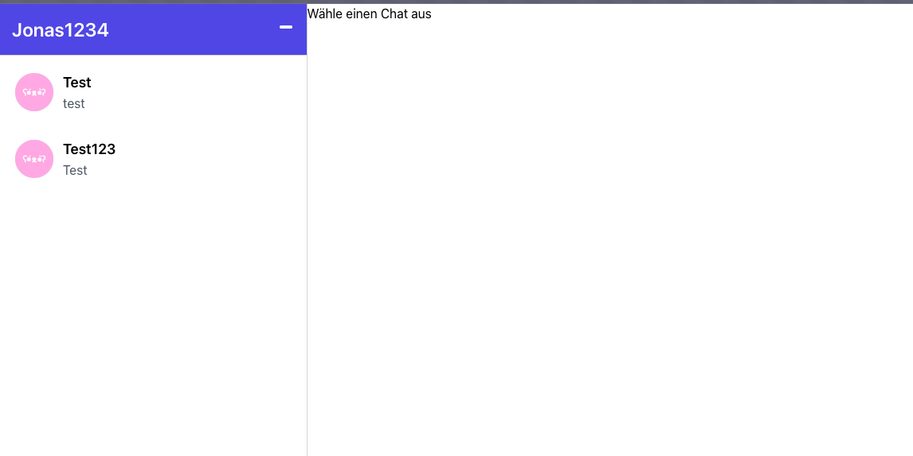

# SimpleMessenger
Das Projekt ermöglicht es eine Web-Anwendung zu hosten, bei der man sich registrieren, Chats erstellen und Nachrichten versenden kann.

## Funktionen

Über den Login Screen (/login) kann man sich als bestehender Benutzer anmelden. 

Falls noch kein Account besteht, kann man über "Jetzt registrieren" zur Registrierung navigieren. Hier müssen dann Email, Benutzername und Passwort angegeben werden. 
**Wichtig:** Email bzw. Benutzername haben durch die Datenbank einen Unique-Constraint!

Nach dem erfolgreichen Login landet man auf der Hauptseite:

Oben links wird der Benutzername des aktuell eingeloggten Benutzers angezeigt. Daruter die sind die Chats zu sehen, bei welchen der Benutzer Teilnehmer ist. Unter dem Chatnamen wird die letzte Nachricht des Chats angezeigt. Standardmäßig ist kein Chat ausgewählt, sodass auch keine Nachrichten angezeigt werden. Sobald ein Chat ausgewählt wurde werden die Nachrichten geladen:

Jetzt können wie gewohnt aus anderen Messengern Nachrichten in Echtzeit versendet werden.
Außerdem lässt sich ein Kontextmenü öffnen in dem neue Chats angelegt werden können bzw. man sich ausloggen kann.

Klickt man auf neuer Chat öffnet sich eine Eingabe:

Hier kann ein beliebiger Chat-Name gewählt werden. Außerdem muss hier der Benutzername des Benutzers, welchen man zum Chat einladen möchte eingetragen werden.